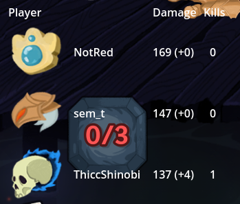

# STS2 Damage Tracker

A UI mod for Slay the Spire 2 that adds a damage and kill tracker to the game! 

Compatable with multiplayer (as of v0.101.0-beta).




---

## Features

Press `TAB` during a run to pull up a table that shows current statistics about your run. These include:
- Number of kills
- Damage dealt, and overkill damage


 This mod does not affect gameplay, so it does not require other members of a lobby to have it installed when in a multiplayer run.

---

## Development Setup

### Prerequisites

Before you begin, ensure you have:

- [.NET 9.0 SDK](https://dotnet.microsoft.com/download/dotnet/9.0)
- [Godot 4.5.1 Mono](https://godotengine.org/download/archive/4.5.1-stable/) - **Download the "Windows 64-bit, .NET" version**
- Slay the Spire 2 installed via Steam

---

### Initial Configuration

#### 1. Clone the Repository
```bash
git clone https://github.com/notred27/sts2_damage_tracker
cd sts2_damage_tracker
```

#### 2. Configure Your Paths

**Windows (PowerShell):**
```powershell
Copy-Item local.props.example local.props
```

**Linux/Mac:**
```bash
cp local.props.example local.props
```

#### 3. Edit `local.props`

Open `local.props` in any text editor and update with **your** paths:
```xml
<Project>
  <PropertyGroup>
    <!-- Example for default Steam installation: -->
    <STS2GamePath>C:\Program Files (x86)\Steam\steamapps\common\Slay the Spire 2</STS2GamePath>
    
    <!-- Example Godot path: -->
    <GodotExePath>C:\Godot\Godot_v4.5.1-stable_mono_win64.exe</GodotExePath>
  </PropertyGroup>
</Project>
```
---

### Building the Mod

#### Visual Studio
Open DamageTracker.csproj as Visual Studio Project

Press **Ctrl+Shift+B** or click **Build → Build Solution**


The mod will **automatically** install to:

Slay the Spire 2/mods/DamageTracker/  
├── DamageTracker.dll  
├── DamageTracker.json  
└── DamageTracker.pck  

---

## Troubleshooting

### "Cannot find Godot executable"
- Make sure `GodotExePath` in `local.props` points to the `.exe` file
- Download the **Mono** version, not the standard version

### "Cannot find Slay the Spire 2"
- Right-click STS2 in Steam → Manage → Browse local files
- Copy the full path and paste into `STS2GamePath`

### Build succeeds but mod doesn't load
- Check that both `ExampleMod.dll` **AND** `ExampleMod.pck` exist in `mods/ExampleMod/`
- Check the game's log file for errors: `%AppData%\Roaming\SlayTheSpire2\Player.log`

### Changes don't appear in game
- Rebuild the mod (**Ctrl+Shift+B**) or with Rebuild Solution
- Restart Slay the Spire 2

---

## Credits

Thank you to [@lamali292](https://github.com/lamali292) for creating the initial template for sts2 Harmony patches. Their original repository can be found [here](https://github.com/lamali292/sts2_example_mod).

